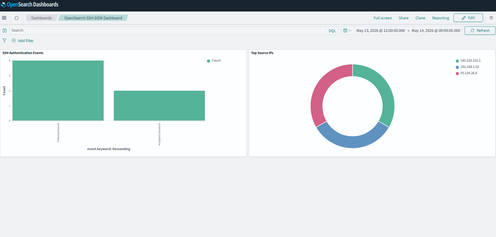
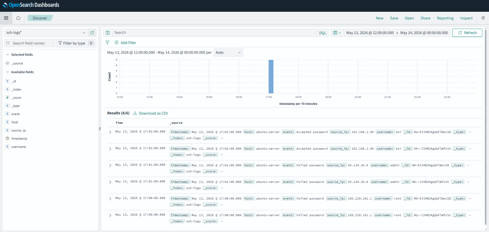

\# OpenSearch SIEM Lab

Built a self-hosted SIEM lab using OpenSearch and Docker to ingest, search, and visualize SSH authentication logs.

\## Features

\- OpenSearch + Dashboards

\- Docker deployment

\- SSH authentication monitoring

\- Failed login detection

\- Source IP visualization

\- SIEM dashboard creation

\## Technologies Used

\- OpenSearch

\- Docker

\- PowerShell

\- JSON

\- SIEM Concepts

\## Dashboard Preview

## Dashboard Preview

### SOC Dashboard

### Threat Hunting in Discover

\## Skills Demonstrated

\- SIEM deployment

\- Threat hunting

\- Log ingestion

\- Security monitoring

\- Dashboard visualization

